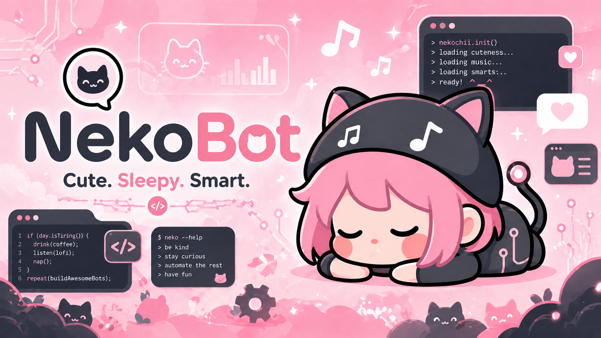
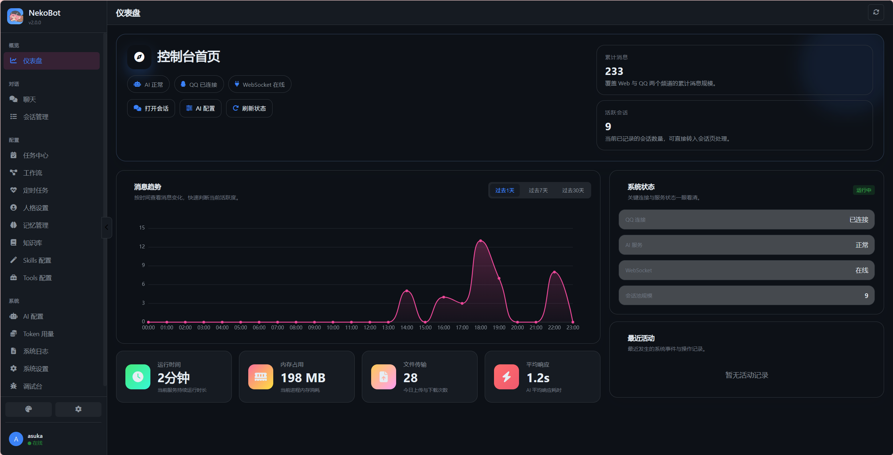
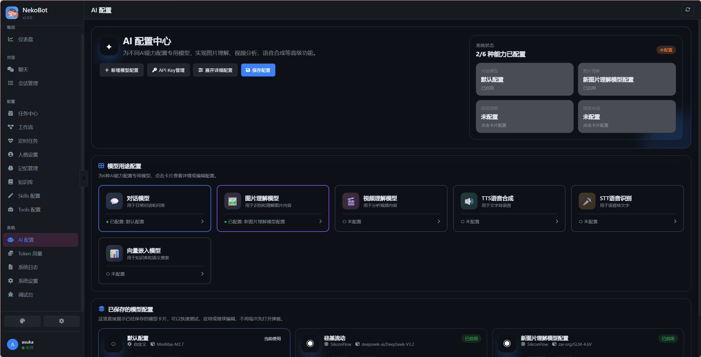

# NekoBot


<div align="center">


一个面向 QQ 与 Web 的多频道 AI 角色扮演项目，集成角色卡系统、聊天、工作区、工具调用、知识库、记忆、工作流与可视化管理后台。

</div>

---

## 项目简介

NekoBot 最初是一个面向 QQ 的聊天机器人项目，现在已经演进为一套更完整的多频道 AI 角色扮演系统：

- **角色扮演系统** - 支持创建、导入/导出角色卡，AI辅助生成角色，角色立绘AI生成
- QQ 与 Web 共用同一套 AI 核心
- 支持会话级与共享工作区
- 支持工具调用、文件读写、搜索、知识库检索
- 提供 Web 仪表盘、AI 配置中心、工作流、日志与调试界面
- 支持保存多模型配置，并在运行时切换

如果你想要的是：

- 一个可以接入 NapCat 的 QQ 机器人
- 一个带 Web 管理后台的 AI 助手
- 一个支持角色扮演和角色卡管理的系统
- 一个支持工作区操作和多轮工具调用的项目骨架

这个项目已经具备这些能力。

---

## 当前能力

### 角色扮演系统

NekoBot 提供完整的 AI 角色扮演解决方案：

**角色卡管理**
- 可视化角色卡编辑器，支持角色名称、描述、性格、背景故事等详细设定
- 角色立绘支持本地上传或 AI 生成（需配置图片生成模型）
- 角色卡导入/导出功能，支持单角色 ZIP 格式和批量导入导出
- AI 辅助创建角色，根据描述自动生成完整的角色设定

**记忆系统（按角色隔离）**
- 每个角色拥有独立的记忆空间，不同角色的记忆互不干扰
- 支持长期记忆和短期记忆（可设置过期时间）
- 记忆与角色绑定，切换角色时自动加载对应记忆
- 工具调用（save_to_memory / read_memory）自动关联当前角色

**多角色切换**
- Web 端支持多角色会话，每个会话可指定不同角色
- QQ 端支持全局角色切换
- 角色状态（好感度、心情等）独立保存

### 核心 AI 能力

- 统一的 `ChatRequest / ChatResponse` 处理链路
- 支持普通聊天与工具调用聊天
- 支持继续执行、上下文裁剪、消息历史管理
- 支持多模型配置与运行时切换
- 支持不同厂商模型的适配层
- 支持 7 种模型用途：对话、图片理解、视频理解、语音合成、语音识别、向量嵌入、图片生成

### Web 管理后台

- 仪表盘首页
- **角色卡管理** - 创建、编辑、导入/导出角色，AI辅助生成角色
- Web 会话与 QQ 会话管理
- AI 配置中心与模型卡片
- 工具、技能、知识库、记忆管理
- 工作流与定时任务
- Token 用量、日志、调试面板
- 文件变更卡片、进度卡片、步骤详情弹窗


*控制台仪表盘 - 监控机器人状态、消息趋势和系统健康*


*AI配置中心 - 配置模型、API密钥和高级设置*

**角色卡编辑器**
- 完整的角色设定：名称、描述、性格、背景故事、开场白等
- 角色立绘：支持本地上传或 AI 生成
- 角色状态：好感度、心情等动态属性
- 批量导入导出：支持 ZIP 格式，方便分享角色卡

### 工作区能力

- 私有工作区：当前会话独享
- 共享工作区：所有会话可访问
- 文件创建、修改、删除、发送
- 文件变更预览与 diff 展示

### QQ 侧能力

- 命令系统
- AI 对话（支持角色扮演模式）
- 漫画相关功能
- 轻小说相关功能
- 定时任务与提醒
- 群聊和私聊场景支持
- 全局角色切换，所有会话共享同一角色设定

---

## 架构概览

当前项目已经从“QQ bot + Web 页面”演进为“统一 AI 内核 + 频道适配层”的结构。

### 启动层

- `bot.py`
  负责加载环境变量、注入运行时配置、启动 QQ 服务与 Web 服务。

### 统一核心层

- `nbot/core/chat_models.py`
  统一 `ChatRequest` / `ChatResponse`
- `nbot/core/agent_service.py`
  统一 AI 处理入口
- `nbot/core/session_store.py`
  统一会话读写
- `nbot/core/model_adapter.py`
  统一模型请求与响应适配

### 频道适配层

- `nbot/channels/base.py`
- `nbot/channels/qq.py`
- `nbot/channels/web.py`

QQ 与 Web 在这里完成输入输出归一化，而不是各自维护一套聊天内核。

### 业务实现层

- `nbot/services/`
  AI、工具、QQ 聊天主链
- `nbot/web/`
  Web 服务、路由、Socket 事件、前端模板

---

## 目录结构

```text
Ncatbot-comic-QQbot/
├─ bot.py
├─ config.ini
├─ .env.example
├─ requirements.txt
├─ nbot/
│  ├─ channels/          # 频道适配层（QQ / Web）
│  ├─ core/              # 统一 AI 核心
│  ├─ plugins/           # 插件
│  ├─ services/          # AI、工具、聊天服务
│  └─ web/               # Web 后台与前端
│     ├─ routes/         # API 路由
│     │  ├─ personality.py    # 角色卡管理
│     │  ├─ ai_models.py      # AI模型配置
│     │  └─ memory.py         # 记忆管理
│     └─ templates/      # 前端模板
├─ data/
│  ├─ qq/                # QQ 相关运行数据
│  ├─ skills/            # Skills 存储
│  ├─ web/               # Web 会话、模型、配置数据
│  │  ├─ personality_presets.json      # 系统角色预设
│  │  ├─ custom_personality_presets.json # 自定义角色卡
│  │  └─ memories.json                  # 记忆数据
│  └─ workspaces/        # 私有 / 共享工作区
├─ docs/
│  ├─ README.md
│  ├─ Chinese.md
│  ├─ CHANGELOG.md
│  └─ docs/
└─ resources/
   ├─ config/
   └─ prompts/
```

---

## 环境要求

- Python 3.11+
- NapCat
- 可用的模型 API Key

推荐先准备好：

- NapCat 的 WebSocket 地址
- 机器人 QQ 号
- 管理员 QQ 号
- 模型 API Key（对话模型）

---

## 安装

### 1. 克隆仓库

```bash
git clone https://github.com/asukaneko/nekobot.git
cd nekobot
```

### 2. 安装依赖

```bash
pip install -r requirements.txt
```

### 3. 配置环境变量

优先推荐使用 `.env`，项目启动时会读取 `.env` 并注入运行时配置，不会自动回写 `config.ini`。

你可以参考：

- [`.env.example`](./.env.example)
- [`config.ini`](./config.ini)

和AI相关的配置都可以在Web端进行配置。
一个最小可运行示例：

```env
WEB_PASSWORD=你的Web登录密码
```

---

## 启动方式

### 同时启动 QQ + Web

```bash
python bot.py
```

### 只启动 Web

```bash
python bot.py --only-web
```

### 禁用 Web，仅启动 QQ

```bash
python bot.py --no-web
```

### 自定义 Web 地址

```bash
python bot.py --web-host 0.0.0.0 --web-port 5000
```

---

## 配置说明

### 1. `.env` 与 `config.ini`

当前推荐策略：

- `.env` 作为运行时优先配置来源
- `config.ini` 作为兼容和兜底配置
- 启动时不会把 `.env` 反向写回 `config.ini`

### 2. AI 模型配置

Web 端支持：

- 保存多个模型配置
- 应用指定模型配置到运行时
- 测试连接
- 显式声明模型能力
  - `supports_tools`
  - `supports_reasoning`
  - `supports_stream`

### 3. 工作区

工作区分为两种：

- `private`
  当前会话私有
- `shared`
  全局共享

共享工作区默认位于：

```text
data/workspaces/_shared
```

---

## Web 后台功能一览

进入 Web 后台后，可以直接使用这些模块：

- 仪表盘
- 聊天
- 会话管理
- AI 配置
- 记忆管理
- 知识库
- Skills 配置
- Tools 配置
- 工作流
- 定时任务
- Token 用量
- 系统日志
- 调试台

最近版本里，Web 会话侧还加入了：

- 流式回复显示优化
- `/命令` 候选面板
- 文件变更卡片与差异预览
- 移动端竖屏聊天输入区适配

---

## 常用命令示例

项目的 QQ 命令较多，完整命令建议直接查看：

- [docs/docs/guide/commands.md](./docs/docs/guide/commands.md)

常见示例：

```text
/help
/workspace
/ws_send <文件名>
/summary_recent
/summary_today
/findbook <书名>
/jm <漫画ID>
```

---

## 文档入口

仓库内还保留了更细的文档：

- [docs/README.md](./docs/README.md)
- [docs/Chinese.md](./docs/Chinese.md)
- [docs/CHANGELOG.md](./docs/CHANGELOG.md)
- [docs/CONTRIBUTING.md](./docs/CONTRIBUTING.md)
- [docs/docs/guide/quick-start.md](./docs/docs/guide/quick-start.md)

如果你只想快速上手，优先看本 README 和 `quick-start`。

---

## 开发建议

如果你要继续扩展这个项目，建议优先沿着当前架构走：

- 新频道接入放到 `nbot/channels/`
- 新的统一能力放到 `nbot/core/`
- QQ / Web 特有逻辑尽量留在适配层
- 工具、AI 服务和工作区能力放在 `nbot/services/`

这样可以保持“统一 AI 内核，多频道适配”的结构不再回退。

---

## 安全提示

- 不要直接把 Web 后台暴露到公网
- 请为 `WEB_PASSWORD` 设置强密码
- 不要把 API Key、NapCat Token、管理员 QQ 号提交到仓库
- 对共享工作区中的写文件能力保持谨慎

---

## License

本项目使用 MIT License。

相关文件见：

- [LICENSE](./LICENSE)

---

## 致谢

- [NapCatQQ](https://github.com/NapNeko/NapCatQQ)
- [ncatbot](https://github.com/NapNeko/NcatBot)

<div align="center">

Made with care by [AsukaNeko](https://github.com/asukaneko)

</div>
